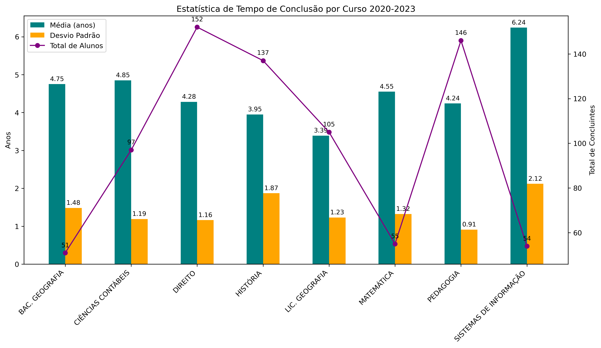
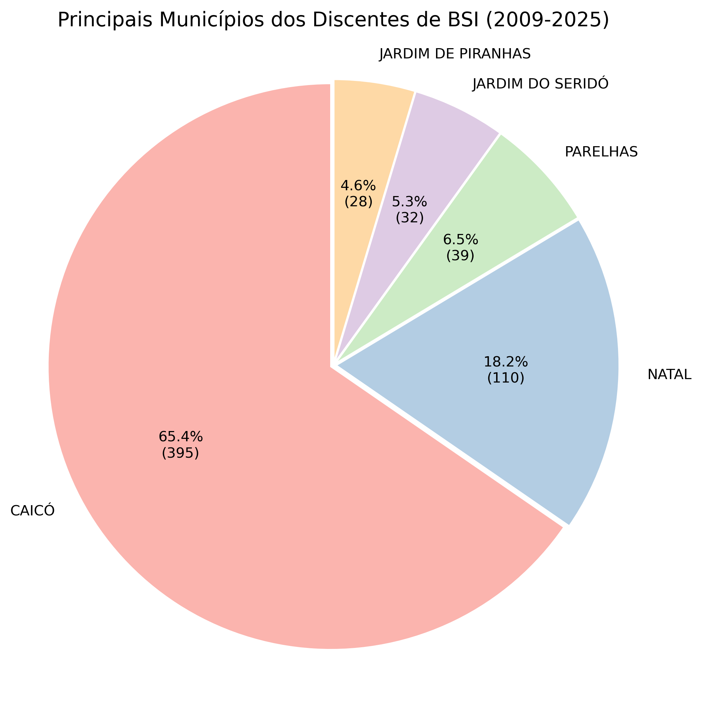

# 📊 Análise Descritiva de Dados Institucionais da UFRN

Repositório criado para a disciplina **Projeto e Administração de Banco de Dados (2025.1)** da UFRN.

## 📚 Fonte dos Dados

- [Dados Complementares de Discentes](https://dados.ufrn.br/dataset/dados-complementares-de-discentes)  
- [Egressos 2020-2023](https://dados.ufrn.br/dataset/egressos)  
- [Docentes](https://dados.ufrn.br/dataset/docentes)  
- [Avaliação da Docência](https://dados.ufrn.br/dataset/avaliacoes-de-docencia)

## 🎯 Objetivos da Análise

- 📈 Evolução no número de alunos por curso e ano
- 👤 Perfil dos alunos: sexo, localidade, raça
- ⏱️ Média de tempo de conclusão para cada curso
- 🏅 Top 3 professores com melhores avaliações (Atuação e Postura)

## 📈 Prévia

### ⌛ Tempo médio de conclusão por curso

---

### 🌍 Distribuição dos discentes por município
